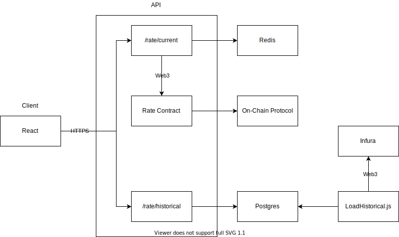

# Design Proposal
After reviewing the requirements and browsing Compound on-chain protocol, there are some thoughts on how we can fetch and display current & historical DAI interest rate. The overall design is a full stack app with two major components: API and Client. The API is an Express JS API with two endpoints: `rate/current` & `rate/historical`. The Client component is React, which will use `rate/` API endpoints to fetch rate data and visualize it.



## Current Interest Rate
The client component will simply use `rate/current` endpoint to get most recent rate. The API will use `Rate` smart contract to interact with on-chain protocol contract such as `CToken` for Compound protocol to pull current rate.

```solidity
pragma solidity ^0.8.4;

contract CToken {
  function supplyRatePerBlock() public returns (uint) {}
}

contract Rate {
  function compoundSupplyRate(address compoundAddress) public returns (uint result) {
    CToken cToken = CToken(compoundAddress);
    return cToken.supplyRatePerBlock();
  }
}
```

According to Compound documentation, we can calculate current interest APY, using `supplyRatePerBlock`:

```javascript
// Load Rate contract and query supplyRatePerBlock in current block
const rateAddress = "0x514a64ce550Fb5dd9Bf8F288e872286067D36C56";
const rateABIJson = JSON.parse(fs.readFileSync('./build/Rate.abi'));
const contract = new web3.eth.Contract(rateABIJson, rateAddress);

const ethMantissa = 1e18;
const blocksPerDay = 4 * 60 * 24;
const daysPerYear = 365;
const supplyRatePerBlock = await cToken.methods.supplyRatePerBlock().call();
const supplyApy = (((Math.pow((supplyRatePerBlock / ethMantissa * blocksPerDay) + 1, daysPerYear))) - 1) * 100;
```

Similar approach can be used to pull supply data from different protocols, but according to their supply data we may need to calculate APY differently. Also The `supplyRatePerBlock` is subjected to change on each block, in case of Compound protocol, we can find out about the changes once `AccrueInterest` is triggered. We can subscribe to this event, and once we get a new `supplyRatePerBlock` we can update our cache to make sure we can have most recent rate. This can help us with performance anytime the client request current rate.

## Historical Data
Unlike current rate, historical rate require some heavy lifting. In order to calculate historical rate, we would need to query and extract the contract logs information. For example, Compound protocol `AccrueInterest` event emitted once any of the following methods are triggered: `mint, redeem, borrow, or repay`. We can query & decode the event logs to help us to calculate the interest rate.

According to Compound protocol, the following attributes are define as:
```
simpleInterestFactor = borrowRate * blockDelta
interestAccumulated = simpleInterestFactor * totalBorrows
totalBorrowsNew = interestAccumulated + totalBorrows
totalReservesNew = interestAccumulated * reserveFactor + totalReserves
borrowIndexNew = simpleInterestFactor * borrowIndex + borrowIndex
```

Using above equations, we can derive `borrowRate`:
```
simpleInterestFactor = borrowRate * blockDelta
borrowRate = simpleInterestFactor / blockDelta
```
All those attribute except `blockDelta` is provided in event logs. Now we need to find out how to calculate `blockDelta`. Thankfully `accrueInterest` stores `accrualBlockNumber` in storage, which provides the block number that interest was accrued. We can use that along with the `fromBlock` to calculate the `blockDelta` for each log.

At this point we can calculate `borrowRate` for each sets of logs. We would need to repeat this for last two months of blocks, and store the average rate for each month in Postgres. We can load and backfill these historical data using `LoadHistorical.js` script:

```javascript
const fs = require('fs');
const Web3 = require('web3');
const abiDecoder = require('abi-decoder');

const web3 = new Web3('https://mainnet.infura.io/v3/1f130364fd12487f86318286d1fefc3e');

const compoundAddress = "0x5d3a536e4d6dbd6114cc1ead35777bab948e3643"
const compoundABIJson = JSON.parse(fs.readFileSync('./compound.abi'));
const contract = new web3.eth.Contract(compoundABIJson, compoundAddress);

const blocksPerDay = 4 * 60 * 24 // (based on 4 blocks occurring every minute)
const blocksPerYear = 2102400

const main = async function() {

  let fromLastDayBlock = await web3.eth.getBlockNumber();
  for (day = 1; day <= 1; day++) {
    fromLastDayBlock = fromLastDayBlock - blocksPerDay

    const rawLogs = await web3.eth.getPastLogs({
      address: compoundAddress,
      fromBlock: fromLastDayBlock
    });

    abiDecoder.addABI(compoundABIJson);
    const accrueInterestLogs = abiDecoder
      .decodeLogs(rawLogs)
      .filter(logs => logs.name === "AccrueInterest");

    const blockNumberPromises = accrueInterestLogs.map(log => {
      return web3.eth.getStorageAt(log.address, 9, fromLastDayBlock)
    });

    const accrueInterestBlockNumbers = await Promise.all(blockNumberPromises);
    accrueInterestLogs.forEach((log, index) => {
      const doneBlock = web3.utils.hexToNumber(accrueInterestBlockNumbers[index])
      log.blockDelta = rawLogs[index].blockNumber - doneBlock;
    });

    const borrowRates = [];
    accrueInterestLogs.forEach(log => {
      // GIVEN
      // interestAccumulated = simpleInterestFactor * totalBorrows
      // THEREFORE
      // simpleInterestFactor = interestAccumulated / totalBorrows

      // GIVEN
      // simpleInterestFactor = borrowRate * blockDelta
      // THEREFORE
      // borrowRate = simpleInterestFactor / blockDelta

      const interestAccumulated = +log.events[1].value;
      const totalBorrows = +log.events[3].value;
      const simpleInterestFactor = interestAccumulated / totalBorrows;
      const borrowRate = simpleInterestFactor / log.blockDelta;
      const borrowRatePerYear =  borrowRate * blocksPerYear
      console.log("Borrow Rate is: ", borrowRatePerYear * 100);
      borrowRates.push(borrowRatePerYear);
    })
  }
}

main().catch(error => console.log(error));
```
