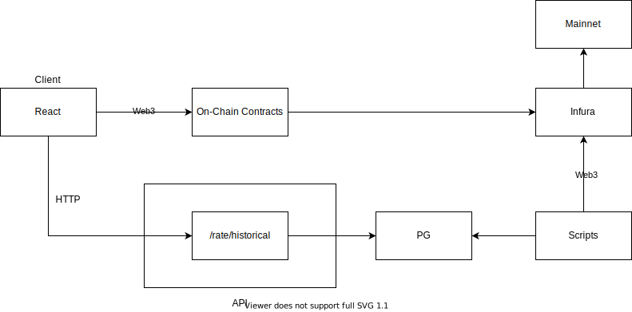

# Overview
A full stack application to visualize DAI historical & current historical interest rates using Compound & MakerDAO (DAI Saving Rate) on-chain protocols. There are 4 different services that power up this application: `api, client, scripts and pg`. Here is a graph to visualize how these services are wired up:



We can build and run these services using `docker compose`. The very first service that boots up is `pg`. This service initialize Postgres database with given database name, password and schema (Checkout `Dockerfile` & `psql_dump.sql` in pg directory). Once `pg` is initialized, `scripts` service will boot up to pull on-chain historical data and store it in Postgres using `pg` service. Next, the `api` will boot up which will expose `rates/historical?protocol=` to provide historical data that was stored in Postgres. The `client` will use this endpoint to pull historical interest rate as well as using Web3, on-chain contracts and Infura.io to pull current interest rate.

# Build & Run
We can build & run this application using docker compose in two steps:
- Create `.env.docker` file
- `make run` command.

## .env.docker
Docker compose will use `.env.docker` file to provide build args & environment variables for docker to build and run those services. We can use `.env.sample` to find out all those necessary environment variables.

## make run
After getting `.env.docker` file ready, we can simply use `make run` command to build and run the services. The log for each service will start showing up when the service start running. Once `scripts` service finish loading historical data and exit with code 0, we can then open http://localhost:8080/ to checkout interest rate changes.

# Notes

## Rate Contract
As part of the requirement, we have developed smart contract with single function `getRates()`, and we deployed it to Ropsten test net, however the rate changes in test network was really steady and not changing very often, so we end up using on-chain contracts directly in Mainnet instead. The information about the contract such as ABI and address is documented in `contracts/README.md`.

## Random Historical Data
By default, we load last 30 minutes historical rates using `load-historical.js` script. The interest rate within that window may have changed, but not very often, so it is likely that initial graph lines would be straight lines. In case you want to experiment with random historical rates, you can use `load-random-historical` script instead. This can be done by overriding command attribute for scripts service in docker-compose file:
```yml
# NOTE: You would need to rerun `make run` once you make this change.
scripts:
  build: ./scripts
  # Enable command below to load random historical rates
  command: ['node', 'load-random-historical.js']
```

